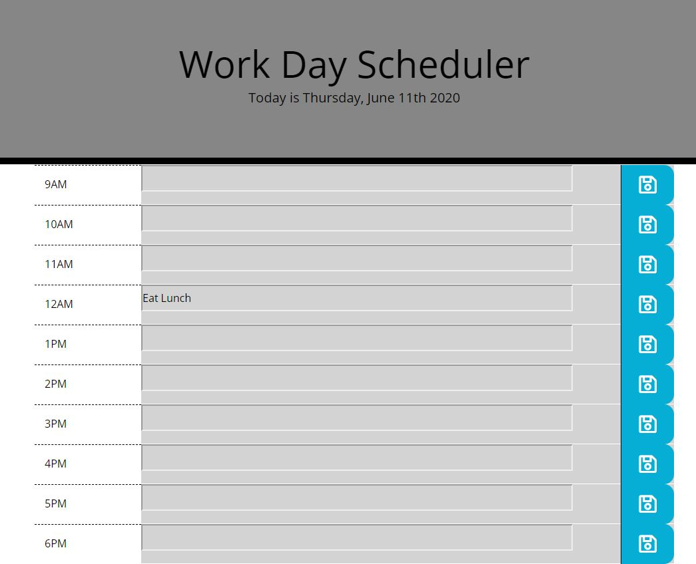
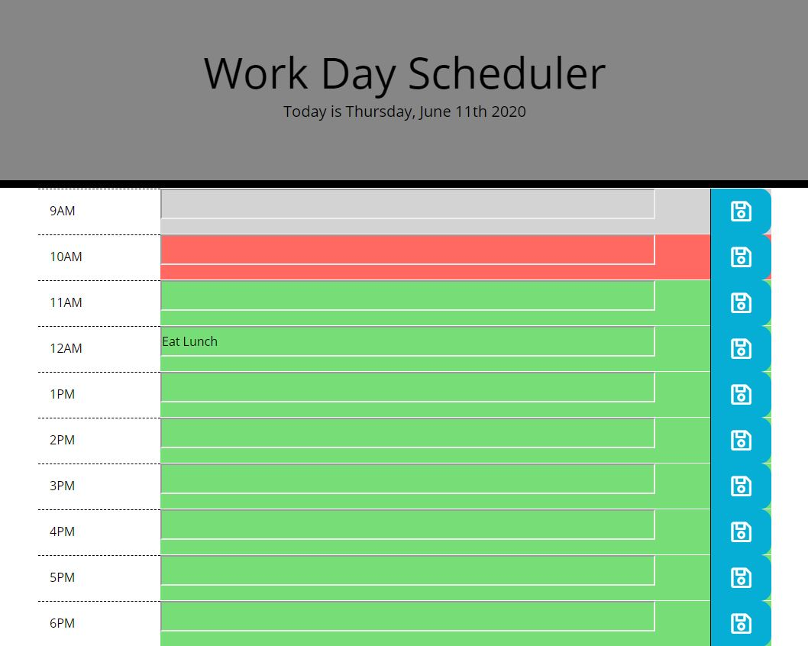
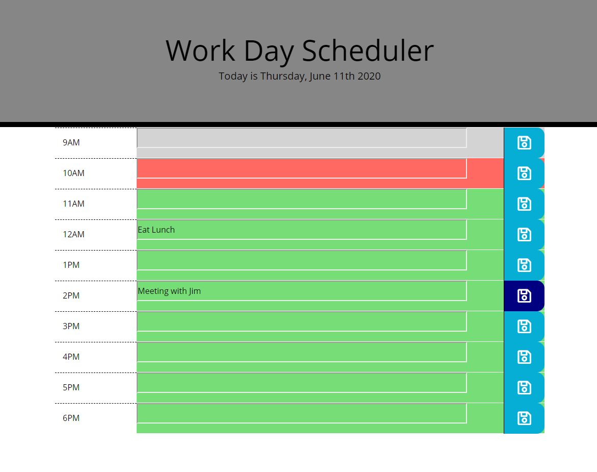

# homework5
Below is a deployed web application that allows you to save your daily schedule. With a user friendly interface, and local storage, anything the user inputs will be saved in the application. 

Built in to the header is a display that shows the user the date that the application was launched. 

Depending on when the application was launched, the color of each row will change, grey for past hours, red for the current hour, and green for future hours.

When the save button is clicked, the itum in the respective input is saved, and the save button flashes to a darker blue, to show the user that the save was confirmed.

Ben de Garcia
https://bdegarcia.github.io/homework5/